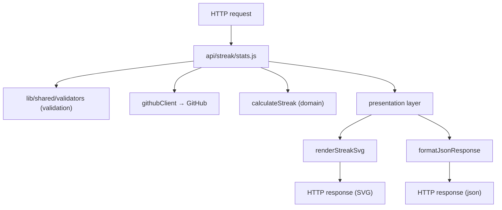

# Porpuse of the document

This document describes the architecture of the:  
**Custom fork of [GitHub Readme Streak Stats](https://github.com/denvercoder1/github-readme-streak-stats) optimized for Vercel deployment.**

Its purpose is to:

- Define how the project's code is organized.

- Explain the responsibilities of each folder and layer.

- Serve as a guide for maintaining a clean architecture as the project grows.

- Prevent business logic from being mixed within Vercel endpoints.

- Document the technical decisions made to adapt the original project to Vercel Serverless Functions.

This document is intended for both myself (the fork's author) and anyone who wants to:

- understand how the project works internally,
- contribute changes,
- or deploy and extend their own instance on Vercel.

# Project structure

```mermaid

graph TD
    A["/api/"] -->B["hello.js"]
    A --> C["streak/"]
    C --> D["stats.js"]
    C --> E["svg.js"]

    F["/lib/"] --> G["cache/"]
    G --> H["contributionsCache.js"]

    F --> I["gitHub/"]
    I --> J["githubClient.js"]
    I --> K["githubMapper.js"]
    I --> L["githubQueries.js"]
    I --> M["githubResponse.js"]

    F --> N["http/"]
    N --> O["handleJsonError.js"]
    N --> P["handleSvgError.js"]

    F --> Q["render/"]
    Q --> R["error_svg.js"]
    Q --> S["formatJsonResponse.js"]
    Q --> T["renderStreakSvg.js"]
    Q --> U["sendSvgResopnse.js"]

    F --> v["shared/"]
    v --> W["errors/"]
    W --> X["BaseError.js"]
    W --> Y["ConfigurationError.js"]
    W --> Z["GitHubApiError.js"]
    W --> AA["index.js"]
    W --> AB["NotFoundError.js"]
    W --> AC["ValidationError.js"]
    v --> AD["validators.js"]

    F --> AE["streak/"]
    AE --> AF["buildYearBlocks.js"]
    AE --> AG["calculateStreak.js"]

    F --> AH["themes/"]
    AH --> AI["errorTheme.js"]
    AH --> AJ["themes.js"]
    
    AK["/docs/"] --> AL["vercel-guide.md"]
    AK --> AM["architecture.md"]

    AN["/test_js/"] --> AO["streak/"]
    AO --> AP["architecture.md"]

```



# Principles of architecture

The chosen architecture responds to specific project needs and limitations inherent to the Vercel environment. Every decision has a clear purpose and avoids problems that would arise later if the architecture weren't properly structured from the start.

### Strict Separation Between Endpoints and Logic
Endpoints in `/api` must be lean because Vercel executes each file as an independent function. Keeping them free of heavy logic prevents duplication, simplifies maintenance, and reduces the risk of errors when adding more routes.

### Logic Independence from the Environment
The streak logic, SVG and Json rendering, GitHub, cache and errors reside in `/lib` so they don't depend on Vercel. This allows them to be tested without a serverless environment and avoids coupling with the platform.

### Modularity and Scalability
Dividing `/lib` into submodules (`cache`,`github`, `http`,`streak`, `render`, `shared/errors`, `themes`) allows each part to evolve without affecting the others. If a new endpoint or output format is added tomorrow, the architecture is already prepared.

### Component Reuse Functions 
Such as validators, error handling, and streak calculations are used at various points in the project. Having them in separate modules avoids duplication and maintains code consistency.

### Adaptation to Clean Architecture 
The structure reflects Clean Architecture principles applied to a serverless environment:

- **Domain**: pure streak logic
- **Infrastructure**: GitHub 
- **Presentation**: SVG and Json rendering
- **Interface**: endpoints in `/api`

This separation allows each layer to change without breaking the others.

### Testing Preparation 
By not mixing logic with endpoints, it is possible to test each module in isolation. This facilitates detecting errors, maintaining quality, and preventing regressions as the project grows.

### Clarity for collaborators and users
A documented and modular architecture makes it easier for others to understand how the project works, where to add new features, and how to extend it without breaking anything.

# Execution flow

The **user** accesses their **GitHub profile**, which triggers an **HTTP request** to Vercel through the endpoint **api/streak/stats.js.**
The endpoint receives the request and first validates the input parameters using the validation layer located in **lib/shared/validators.**
Once the data is validated, the endpoint itself acts as an orchestrator: it queries the **GitHub API** using **githubClient** to obtain the necessary information and then sends that data to the **domain layer**, where the **streak statistics** are calculated.
With the statistics processed, the orchestrator decides on the **output** format requested by the user and delegates the generation of the result—either an SVG or a JSON—to the **presentation layer**.
Finally, the endpoint returns the corresponding HTTP response in the chosen format.

# Diagram



# Testing

The project originated from a fork, so it wasn't built from scratch. A functional foundation already exists, and strictly applying TDD doesn't make sense. The strategy is incremental: each time a significant part of the system is added or modified, tests are incorporated to ensure its correct operation.
The goal isn't complete coverage, but rather ensuring that the project's critical components are reliable, easy to understand, and compatible with future extensions.

## Principles/rules that apply

- Relevant new code is tested.

- The domain layer is prioritized because it contains the core logic.

- Tests should help make the project understandable to any contributor.

- Compatibility and maintainability are prioritized over dogmatism.

## What to test and what NOT to test 

### Test

- `calculateStreak`  (project core)
- `validators` (user entry)
- `renderStreakSvg` (visual output)
- `formatJsonResponse` (alternative output)
- `buildYearBlocksFromDate` (build moduls years)
- `githubResponse`(handle errors)


### No testing

- Runtime of Vercel
- Objects req / res
- Wiring HTTP
- Deploy or infrastructure

These parts depend on the serverless environment and do not add value to the unit test.

## Testing tools

Vitest is used because:

- It's natively compatible with modern Node projects
- It requires very little configuration
- It's fast to run and integrate

## SETUP Vitest

```bash

npm install -D vitest

```

Add to package.json

```json

{
   "scripts": {
    "test": "vitest",
    "test:run": "vitest run"
    }
}

```


# Roadmap

Lista clara de lo que querés implementar más adelante.
Incluye:
- mejoras planificadas
- nuevas features
- optimizaciones
- soporte para más formatos
- mejoras de caching
- internacionalización
- configuraciones avanzadas del SVG
- cualquier idea futura que quieras dejar registrada
Es una sección viva: no describe el presente, sino el futuro del proyecto.

# Technical decisions


## Why do i use SVG instead of PNG?

- Scalable without loss of quality
- Minimal file size (1-2KB vs. 20-30KB)
- Styleable with CSS (dark mode, etc.)

## why do i use GitHub API REST o GraphQL?

- Menos requests (una consulta = todos los años)
- Menos sobrecarga de datos
- Límites de rate más generosos

## Why don't use heavyweight frameworks?

- Cold starts más rápidos en Vercel
- Menor superficie de ataque (seguridad)
- Dependencias mínimas (0 vulnerabilidades)

Incluye:
- por qué elegiste Vercel
- por qué usás arquitectura limpia
- por qué separaste dominio / infraestructura / presentación
- cualquier decisión que afecte al diseño del proyecto
- por qué elegiste esa estructura de carpetas
- por qué evitás lógica en los endpoints

La clave es justificar cada decisión con:

- simplicidad
- mantenibilidad
- rendimiento
- claridad
- escalabilidad
